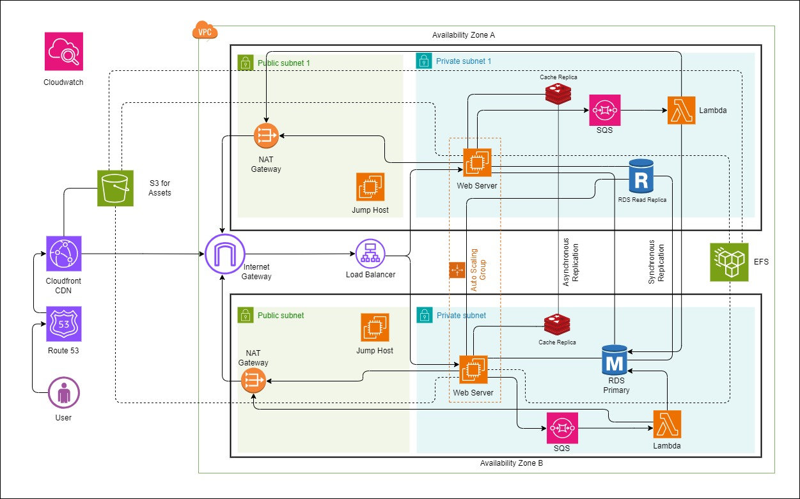

## Part: A - Develop & Deploy a REST API
1. I created a simple REST API with the `FastAPI` framework of Python. The `API Key` of the third party API can be found in [secrets.yaml](./k8s/secrets.yaml) as `base64` encoded format.

2. Created the CI/CD pipeline with `Github Action` which triggers on a new release and build the REST API image and Push to [Docker Hub](https://hub.docker.com/r/shazolkh/bs-test) public repository.

3. The **Terraform** code creates a Kubernetes Cluster in `AKS` on `Azure`. Also the `remote Backend` is configured to store the data on Azure Blob storage.

4. And finally, CI/CD pipeline is updated to run the manifest files of `k8s` folder and set the tag of docker image with the `latest release version`.

## Part: B – System Architecture

I choose **AWS** to the e-commerce application, the approach would be similar in principle, but utilize the specific services offered by AWS. Here's how the architecture would adapt:

Primarily, all the major components of the system will be in the `Private Subnet` of the VPC. In the architecture, I used two `Availability Zone` to provision the system which can be extended to more zones and also more VPCs can be deployed to multiple regions and we can use `VPC Peering` to transfer the data between VPCs.

I used `CloudFront` to cache the static content globally for fast delivery. CloudFront edge caches located worldwide ensure low latency for static content delivery regardless of user location. And used the `S3` bucket for storing the objects and potentially to store the `Logs`. And store and exchange bulk data securely with external APIs.

Now we need a `Load Balancer` which is connected to `Internet Gateway` and `EC2` instances to distribute traffic for high availability. The instances will scale-out and scale-in automatically with the help of `Auto Scaling Group`. 

Instade of deploing the code directly to `EC2`, we can use `ECS`, `CodeBuild` and `CodeDeploy` tools to docerize the code and Deploy them in Container in `Fargate` or `EC2`. Also, `EKS` can be a goog option to deploy the system.

To store the data, I used to `RDS` and also made a Read replica to another zone for high availability. For cacheing the Backend data, Redis can be used. Also we need to replicate the cache data to another zone where another redis server is deployed.

To run the background tasks, we can use the `Lambda` serverless functions for asynchronous background tasks like order processing, emails, or scheduled data processing. And to trigger the functions on Lambda, `Simple Queue Service` is used. Instead of `SQS`, we can use `EventBridge` or better option can be using the `AWS SDK` on Backend code. But `SQS` can be used for asynchronous messaging with external systems. 

`CloudWatch` is used for proactive issue detection and cost optimization. It will also be used to monitor the application, resources, and infrastructure. 
